# Lab 2: Explore GitHub advanced security features

### Estimated Duration: 100 Minutes

## Overview

In this lab, you'll explore GitHub Enterprise features, which are GitHub's advanced security features. You'll configure and explore Code scanning, CodeQL alerts, Repository security advisories, and GitHub Dependabots.  

## Objectives

You will be able to complete the following tasks:

- Task 1: Enabling Code scanning and CodeQL alerts
- Task 2: Repository security advisories
- Task 3: Using Dependabot
- Task 4: Explore Secret Scanning (READ-ONLY)   

## Task 1: Enabling Code scanning and CodeQL alerts 

In this task, you'll configure Code scanning and explore CodeQL alerts. Code scanning is a feature that you use to analyze the code in a GitHub repository to find security vulnerabilities and coding errors. Any problems identified by the analysis are shown on GitHub.

**Note:** To perform this task, the GitHub repository should be public. If the repository visibility is private, please go to the settings of the repository and change the visibility to public.
   
1. Select the **Settings (1)** tab from the GitHub browser tab. Click on **Advanced security (2)** under the **security** section.

   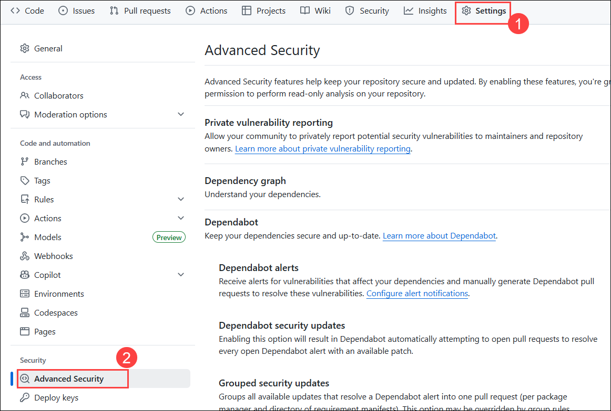  
   
1. Under the Code scanning section, click on **Set up** **(1)** button to enable CodeQL analysis and select the **Advanced** **(2)** option for creating a CodeQL Analysis YAML file.

   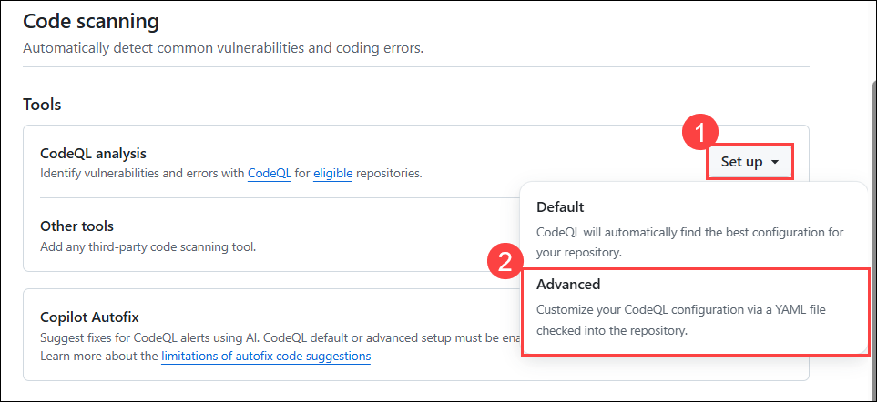      

1. Update the workflow name to **codeql-analysis.yml (1)** and review the yaml file. Select **Commit changes (2)**.
  
    

1. On the Commit changes section, select **Commit directly to the main branch (1)** and click on **Commit changes (2)**.

    
  
1. Navigate to the **Actions (1)** tab to review the workflow run **(2)**.
    
   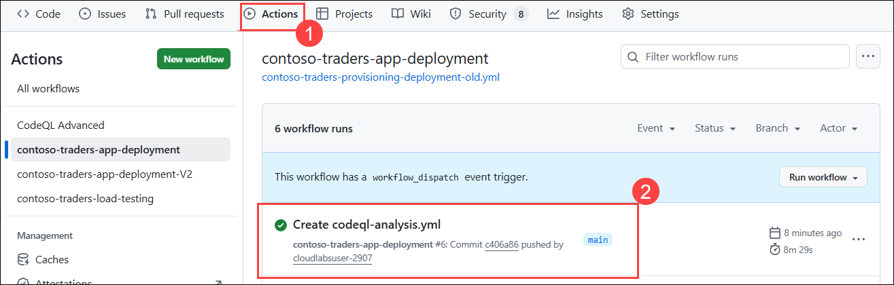 

1. Navigate to the **Security** **(1)** tab and select **Overview** **(2)**. Under the **Code scanning alerts** section, click **View alerts** **(3)** to review any vulnerabilities identified by the configured code analysis tool.

   
   
   > **Note:** If code scanning is not yet enabled, you will see an option to **Set up code scanning** instead. Click **Set up code scanning** to configure it.
  
1. You will be navigated to the **Code scanning** section, where you can view alerts related to your workflows.
   
   
   > **Note:** If you don’t see any alerts here, that’s okay! It simply means no issues were detected at this time.
    
## Task 2: Repository security advisories  
 
In this task, you'll enable Repository security advisories. You can use GitHub Security Advisories to privately discuss, fix, and publish information about security vulnerabilities in your repository.  Anyone with admin permissions to a repository can create a security advisory.
 
1. Navigate to **Security (1)** tab, select **Advisories (2)** from the side blade and click on **New draft security advisory (3)**.

     
     
1. In the Open a draft security advisory tab, under the Advisory Details section, provide the following details.

   - Title: **Improper Access Control in aiw-devops-with-github-lab-files/src/TailwindTraders.Ui.Website/src/App.js (1)**
   - CVE identifier: **Request CVE ID later (2)**
   - Description: **Add (3)** the below-mentioned details in the description section.
   
      ```
      Impact
      What kind of vulnerability is it? Who is impacted?

      HTTP request handlers should not perform expensive operations such as accessing the file system, executing an operating system command or interacting with a        database without limiting the rate at which requests are accepted. Otherwise, the application becomes vulnerable to denial-of-service attacks where an attacker      can cause the application to crash or become unresponsive by issuing a large number of requests at the same time.

      Patches
      Has the problem been patched? What versions should users upgrade to?

      It is patched and rectified the error. Please use 1.2 version

      Workarounds
      Is there a way for users to fix or remediate the vulnerability without upgrading?

      // set up rate limiter: maximum of five requests per minute
      var RateLimit = require('express-rate-limit');
      var limiter = new RateLimit({
      windowMs: 1601000, // 1 minute
      max: 5
      });

      // apply rate limiter to all requests
      app.use(limiter);

      Added the above code in app.js

      References
      Are there any links users can visit to find out more?

      https://github.com/OWASP/API-Security/blob/master/2019/en/src/0xa4-lack-of-resources-and-rate-limiting.md
      https://codeql.github.com/codeql-query-help/javascript/js-missing-rate-limiting/
      ```
    
      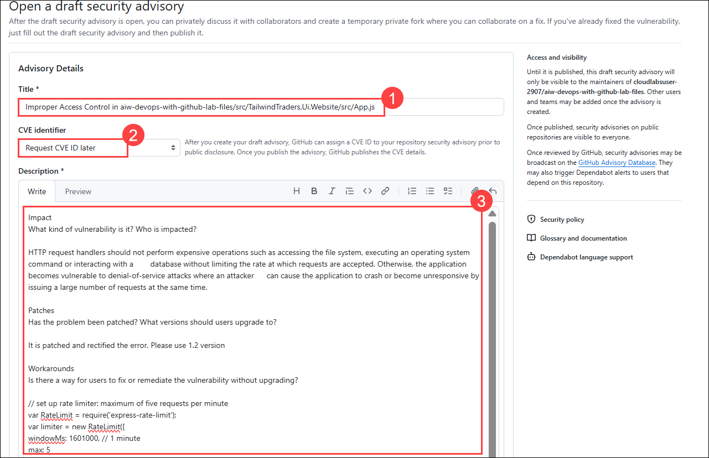
   
1. In the Affected products section, provide the following details and click on **Create draft security advisory (7)**   
 
   - Ecosystem: **Composer (1)**
   - Package name: **aiw-devops-with-github-lab-files/src/TailwindTraders.Ui.Website/src/App.js (2)**
   - Affected version: **<1.2 (3)**
   - Patched version: **1.2 (4)**
   - Severity: **High (5)**
   - Common Weakness Enumerator (CWE): **Improper Access Control (CWE-284) (6)**
  
      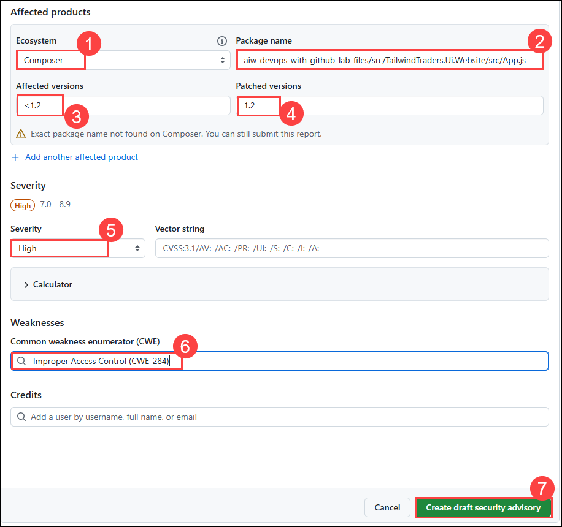
   
 1. Once the security advisory is created, scroll down and click on **Start a temporary private fork**. It is used to collaborate on a patch for this advisory.

    
    
    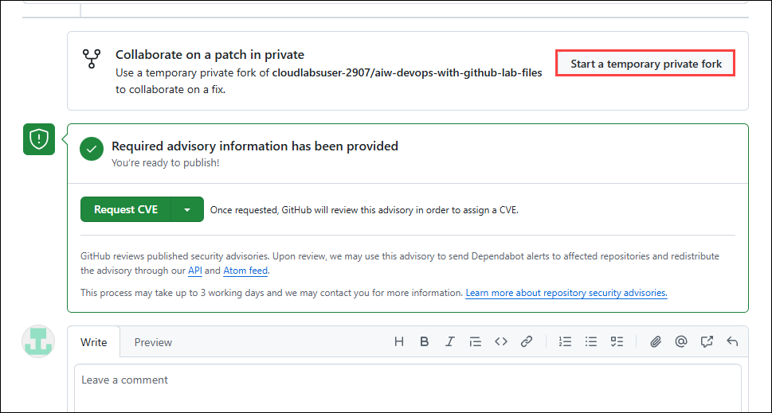
  
 1. After having the temporary fork, you can **Request CVE**, which is used for GitHub reviews and published security advisories. Upon review, we may use this advisory to send Dependabot alerts to affected repositories and redistribute the advisory through our API and Atom feed.

    

      >**Note:** Select **Request CVE** again, on the pop-up. And this process may take up to 3 working days. You can continue to the next tasks now. 
 
## Task 3: Using Dependabot

In this task, you will use Dependabot to track the versions of the packages we use in our GitHub repository and create pull requests to update packages for us.

1. In your lab files GitHub repository, navigate to the **Settings (1)** tab and select the **Advanced security (2)** under Security from the side blade. Make sure **Dependabot alerts** is **Enabled**, if not click on **Enable (3)** to enable Dependabot alerts. Click on **Enable (4)** to enable Dependabot security updates.

   > **Note:** Enabling the `Dependabot security updates` will also automatically enable `Dependency graph` and `Dependabot alerts`.

   

   > **Note:** The alerts for the repository may take some time to appear. The rest of the steps for this task rely on the alerts being present.

1. To observe Dependabot issues, navigate to the **Security (1)** tab and select the **View Dependabot alerts (2)** link.

   

1. You should arrive at the `Dependabot alerts` blade in the `Security` tab.

   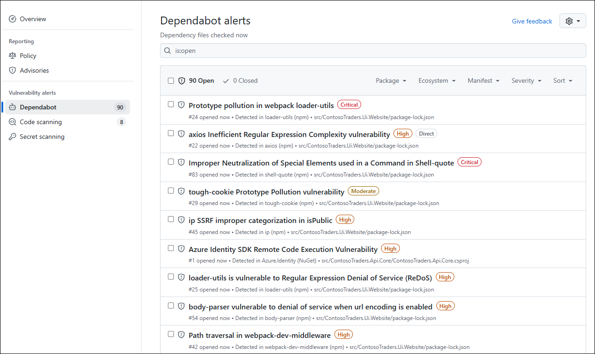

1. Sort the Dependabot alerts by `Package name`. Under the **Package (1)** dropdown menu, search for **node-forge (2)** by typing in the search box and select **node-forge (3)** vulnerability.

   

1. Select any of the `node-forge` Dependabot alert entries to see the alert detail. After reviewing the alert, select **Review security update**.

   
   
   > **Note:** If you see the **Create Dependabot security update** option, click on it. Once the update is created, select **Review security update** to proceed.

1. Once **Review security update** is selected, it will redirect to the **Pull request** page.

   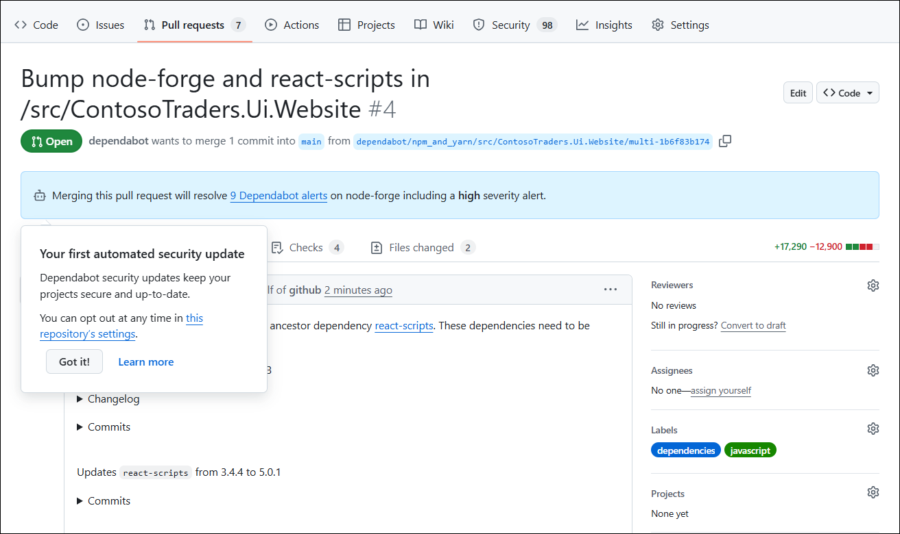

1. Once all checks have passed, scroll down and click on **Merge pull request**, then click **Confirm merge** to complete the process.

   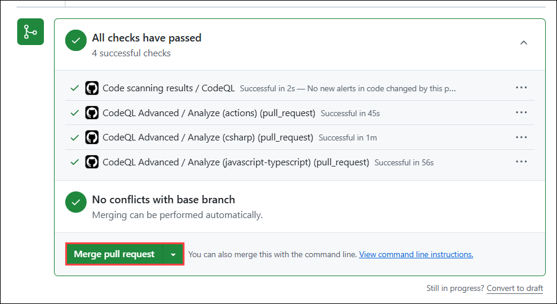
    
   >**Note:** In case you see any errors with the merge request. Retry steps 4 to 6 by selecting any other Dependabot alert.
  
## Task 4: Explore Secret Scanning (READ-ONLY)   

In this task, you'll explore how secret scanning works and see how it generates alerts. GitHub scans repositories for known types of secrets to prevent fraudulent use of secrets that were committed accidentally.

**Note:** This is a **READ-ONLY** task. Please do not perform the steps in the lab environment.

1. From your GitHub repository, click on the **Settings** tab.

   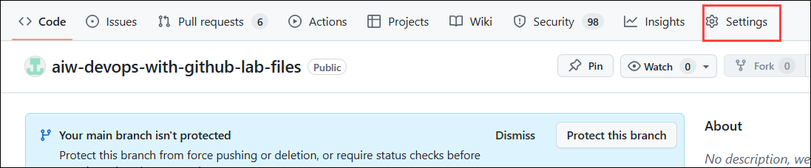
    
1. Select **Code security** from the sidebar and make sure **Secret Protection** and **Push protection** is **Enabled**.

      
    
1. Navigate back to **Code (1)** and click on **src (2)** folder.

   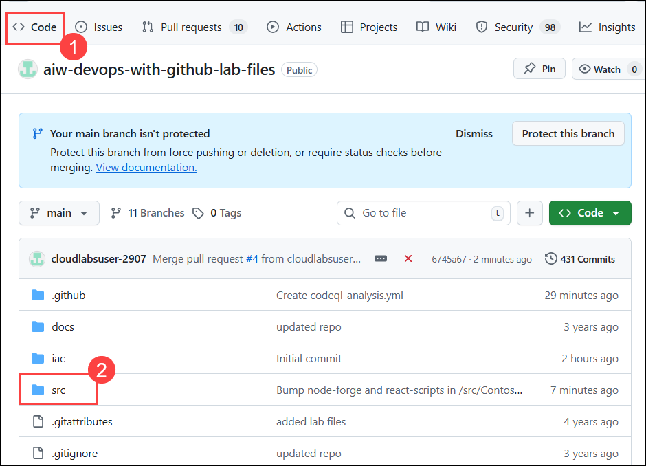    
   
1. Click on **Add file (1)** and select **Create new file (2)** option.

   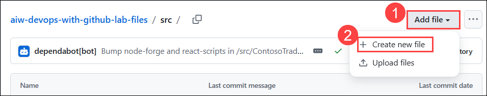    
   
1. Enter file named as **build.docker-compose.yml** **(1)**, add the code provided below into the file **(2)**, and then **commit (3)** it. This file will include the configuration to expose the **Application ID** of a service principal. 

   >**Note:** Replace your `<Application ID>` and `<Secret Key>` in the code.

   ```
   version: "3.4"
   services:
   api:
      build: ./ContosoTraders.Ui.Website/
      app id: <Application ID>
      app secret: <Secret Key>
   web:
      build: ./ContosoTraders.Api.Products
   ```
   
   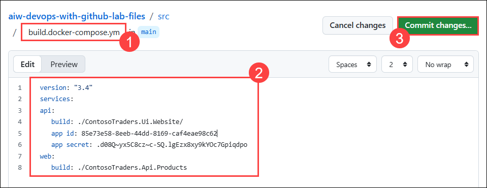

1. Click on Commit changes again, and if the window opens for Secret scanning, then select **Its used in tests** and commit changes again. 

1. Go to the **Security tab (1)** and click on **Secret scanning (2)** under **Vulnerability alerts** in the sidebar. In the filter options, change the status to **Closed (3)**. Here, you'll notice that an alert is generated referring to the same **Application Secret** which was exposed in the `build.docker-compose.yml` file. This is how the Secret scanning feature works and generates alerts to notify you.

    
   
## Summary

In this exercise you have completed the following:
 - Configured and utilized advanced GitHub Enterprise security features.
 - Set up and analyzed Code Scanning and CodeQL alerts.
 - Managed Repository Security Advisories to identify potential vulnerabilities.
 - Enabled and reviewed GitHub Dependabot to automate dependency updates and security fixes.

###  You have successfully completed the Hands-on Lab

By completing this lab, you have gained hands-on experience in designing and implementing a complete CI/CD pipeline using GitHub Actions, along with integrating advanced security practices into your development workflow. You learned how to automate build, test, and deployment processes, apply modern deployment strategies, and leverage reusable and advanced workflows to improve efficiency and reliability. In addition, you explored GitHub’s built-in security capabilities, such as secret scanning, code scanning, and Dependabot to proactively identify and mitigate risks in your codebase. Overall, this lab equips you with the practical skills needed to build, deploy, and secure applications using GitHub and Azure, ensuring a robust, automated, and secure software delivery process.